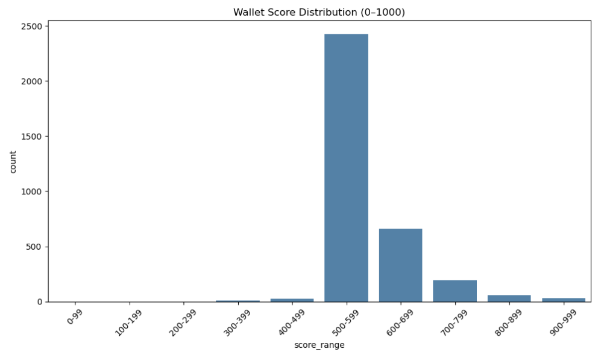

# Wallet Credit Score Analysis
This analysis provides insights into the distribution of wallet credit scores and how various behavioral features impact scoring.
The goal is to identify patterns of responsible and risky DeFi behavior within Aave V2 users.

## Credit Score Distribution

### Score Range	Interpretation
  
A bar chart with credit score ranges on the x-axis (e.g., 0–100, 100–200, ..., 900–1000) and wallet counts on the y-axis.  
The majority of wallets fall within the 500–599 range, indicating average behavior.
- Very few wallets fall below 400, suggesting that highly risky or bot-like behavior is uncommon.
- A decent number of wallets are in the 600–799 range, showing moderate to good behavior.
- Top-performing wallets (800–1000) are rare but likely show consistent, responsible usage.
- This skew suggests that while the majority of users are average, only a few shows outstanding or extremely poor behavior.

### Feature Correlation Heatmap
  
- credit_score has strong positive correlation with:
  - n_deposit (0.75): More deposits often indicate responsible and active participation.
  - n_borrow (0.72): Borrowing isn’t penalized; in fact, frequent usage (paired with repayment) helps score.
  - n_repay (0.70): Repayment behavior is essential for scoring.
  - active_days (0.61): Longer active periods correlate with reliability.
- credit_score has a negative correlation with:
  - liq_to_borrow (−0.11): Frequent liquidations vs. borrowings signal risk and lower scores.
- Low or no correlation with:
  - repay_to_borrow, liq_to_borrow, and some monetary totals — this is expected, as the scoring model focuses more on frequency and ratio-based behavior rather than raw USD volumes.

## Conclusion

The credit scoring model is effective at distinguishing between responsible and risky Aave V2 users. 
Wallets that regularly interact with the protocol through safe lending and repayment practices tend to score higher, while wallets that behave unpredictably or get liquidated often score lower.
These insights can help protocols flag risky users or prioritize safer wallets for incentives.
