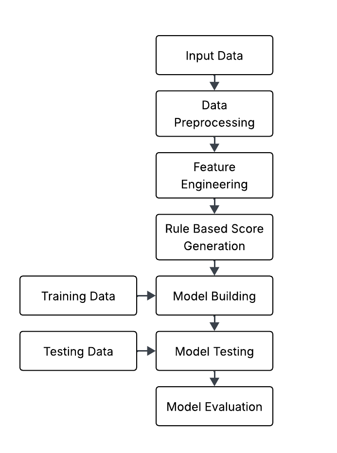

# Aave-V2-Wallet-Credit-Scoring!

## Overview
This project addresses the challenge of assigning credit scores (ranging from 0 to 1000) to wallets interacting with the Aave V2 DeFi protocol, using historical transaction-level data.
Each score reflects how responsible or risky a wallet’s behavior is based on its on-chain actions like deposits, borrows, repayments, liquidations, and withdrawals.

## Method Chosen
Followed a hybrid approach:  
Start with a rule-based scoring system using domain knowledge to assign initial credit scores.  
Use these scores as training labels to build a Random Forest Regression model that generalizes scoring for any wallet.  
This approach helps blend explainability (rules) and learning from patterns (ML).  

## Architecture

### 1.Input
JSON file containing 100K Aave V2 user transactions.  
Each transaction has fields like userWallet, action, amount, assetPriceUSD, and timestamp  

### 2.Data Preprocessing
+ Loaded the data using json.load() and pandas.json_normalize()
+ Converted timestamps to datetime format
+ Converted amount and asset price fields to floats
+ Computed amount_usd = amount × assetPriceUSD

### 3.Feature Engineering
For each wallet, extracted a variety of features from its transaction history to capture different aspects of its behavior:

Count-based features help us understand how frequently a wallet performs different types of actions. This includes:
+ The number of deposits (n_deposit)
+ The number of times borrowed (n_borrow)
+ The number of repayments (n_repay)
+ The number of times liquidated (n_liquidation)
+ The total number of transactions (tx_count)

Value-based features measure how much value was moved in USD terms through different actions. These include:
+ Total USD deposited (total_deposit_usd)
+ Total USD borrowed (total_borrow_usd)
+ Total USD repaid (total_repay_usd)

Ratio-based features capture behavioral quality. These are calculated as:
+ repay_to_borrow: How much of the borrowed amount was repaid
+ liq_to_borrow: How often borrowing resulted in liquidation

Time-based features give us an idea of wallet longevity and activity spread:
+ first_tx: Timestamp of the wallet's first transaction
+ last_tx: Timestamp of the wallet's most recent transaction
+ active_days: Number of days between the first and last transaction

Together, these features help describe how active, responsible, or risky a wallet has been over time.

### 4.Rule-based Score Generation
We used a basic formula to calculate initial credit scores:  
score = 500  
+n_deposit * 3  
+n_repay * 5  
-n_liquidation * 10  
+repay_to_borrow * 100  
-liq_to_borrow * 50  
This helped bootstrap the scoring system with basic behavioral assumptions.

### 5.Model Training
To predict wallet credit scores, trained a machine learning model using the **RandomForestRegressor** from scikit-learn. Configured the model with n_estimators=100 to build 100 decision trees and used a fixed random_state for reproducibility.  
Input Features:  
'n_deposit', 'total_deposit_usd', 'n_borrow', 'total_borrow_usd', 'n_repay', 'total_repay_usd', 'n_liquidation', 'repay_to_borrow', 'liq_to_borrow', 'active_days', 'tx_count'

Label:  
Rule-based credit score generated earlier

### 6.Evaluation Metrics
To evaluate the performance of our credit scoring model, we used two key regression metrics:  
**Mean Absolute Error (MAE):** This measures the average absolute difference between the predicted credit scores and the actual rule-based scores. It gives a clear sense of how far off, on average, our model’s predictions are.  
**Mean Squared Error (MSE):** This metric penalizes larger errors more than MAE by squaring the differences. It helps highlight significant prediction mistakes that might indicate outliers or poor generalization.  
These metrics provide a quantitative assessment of how well the model learned from the rule-based labels and how accurately it can assign scores to new wallets.

### 7.Visualization
To better understand model behavior and the dataset itself, generated several visualizations:  

Actual vs Predicted Scores (Scatter Plot): This plot compares the predicted scores to the actual rule-based scores. A line of best fit or identity line is included to show how close the predictions are to reality. The closer the points lie to the diagonal, the better the model performance.  

Feature Correlation Heatmap: This heatmap shows the pairwise correlation between all features and the credit score. It helps detect which features are most influential and whether any multicollinearity (strong correlation between features) exists, which can affect model stability.
